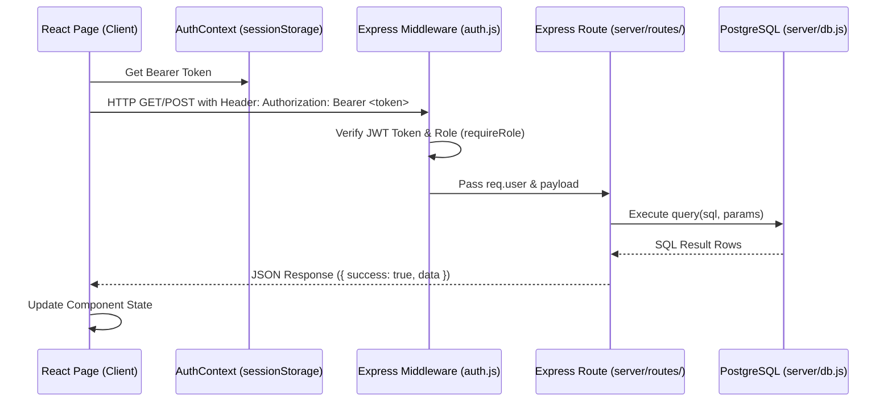
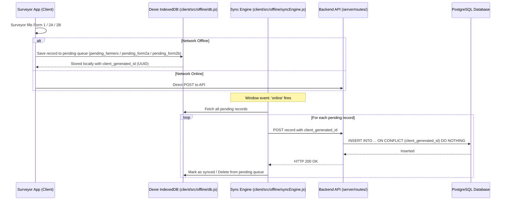

# 🛠️ KisanPortal - Developer Architecture & Codebase Guide

---

## 📌 1. Project Directory Structure

Here is the high-level map of the codebase to help you quickly find files:

```
c:/farmer-survey/
├── 📁 client/                       # React Frontend (Vite)
│   ├── 📁 public/                   # Static public assets
│   └── 📁 src/                      # Source code
│       ├── 📁 components/           # Reusable UI components (NavBar, PrivateRoute, Search, Layouts)
│       ├── 📁 context/              # React Context (AuthContext.jsx - session & token storage)
│       ├── 📁 offline/              # Client-side IndexedDB & Sync Engine
│       │   ├── db.js                # Dexie IndexedDB local database tables
│       │   └── syncEngine.js        # Background sync queue engine
│       ├── 📁 pages/                # Page components (Login, Dashboard, SurveyForm, Form2A, etc.)
│       ├── 📁 services/             # Helper services (geoService.js for GPS prefetching)
│       ├── 📁 utils/                # Helper utilities (dateFormatter.js)
│       ├── App.jsx                  # Main router setup & route protection
│       └── index.css                # Global CSS styling
│
├── 📁 server/                       # Node.js / Express Backend
│   ├── 📁 middleware/               # Express Middlewares
│   │   ├── auth.js                  # JWT token verification & role enforcement (requireRole)
│   │   └── rateLimiter.js           # Rate limiting rules (loginLimiter, apiLimiter)
│   ├── 📁 routes/                   # API Endpoint Controllers
│   │   ├── auth.js                  # Login, Logout, Users list, Passwords
│   │   ├── farmers.js               # Form 1 (Farmer profile CRUD & search)
│   │   ├── form2.js                 # Form 2A (Seasonal) & Form 2B (Visits) APIs
│   │   └── surveyors.js             # Surveyor management & visit assignments
│   ├── db.js                        # PostgreSQL connection pool & initDb() schema migrations
│   └── index.js                     # Express server entry point
│
├── 📁 api/                          # Serverless wrapper for Vercel / Render deployment
│   └── index.js                     # Serves Express app via API handler
│
├── export-codebase.js               # Script to bundle codebase into full_codebase.md
├── Dockerfile                       # Docker container configuration
└── package.json                     # Root project dependencies & build scripts
```

---

## 🔄 2. End-to-End Data Flow

### 🌐 A. Standard Online Request Flow



---

### 📶 B. Offline Survey Data & Sync Flow



---

## 💡 3. Developer Cheat Sheet: Where to Make Changes

### ❓ *"I need to add or edit a User Page / Form on the Frontend"*
1. **Locate or Create Page**: Go to `client/src/pages/`.
   - Form 1: `client/src/pages/RegistrationForm.jsx`
   - Form 2A & 2B: `client/src/pages/Form2A.jsx` & `client/src/pages/SurveyForm.jsx`
   - Admin Dashboard: `client/src/pages/AdminDashboard.jsx`
   - Surveyor Home: `client/src/pages/SurveyorHome.jsx`
2. **Add Route**: If creating a new page, register the route in [client/src/App.jsx](file:///c:/farmer-survey/client/src/App.jsx) wrapped inside `<PrivateRoute allowedRoles={['...']}>`.

---

### ❓ *"I need to add or edit an API Endpoint on the Backend"*
1. **Locate Route File**: Go to `server/routes/`.
   - Authentication & User Management: `server/routes/auth.js`
   - Farmer Profiles (Form 1): `server/routes/farmers.js`
   - Form 2A & Form 2B Routes: `server/routes/form2.js`
   - Task Assignments & Surveyor APIs: `server/routes/surveyors.js`
2. **Protect the Route**: Always add `authenticateToken` and `requireRole(...)`:
   ```javascript
   router.post('/my-endpoint', authenticateToken, requireRole('admin', 'superadmin'), async (req, res) => {
     // ...
   });
   ```

---

### ❓ *"I need to add a new Table or Column to the Database"*
1. Open [server/db.js](file:///c:/farmer-survey/server/db.js).
2. Add your table definition inside `initDb()` using `CREATE TABLE IF NOT EXISTS`.
3. Add safe migration statements for existing installations:
   ```javascript
   await pgPool.query(`ALTER TABLE farmers ADD COLUMN IF NOT EXISTS my_new_column TEXT DEFAULT ''`);
   ```
4. **Query Helper**: Use `query(sql, params)` or `run(sql, params)` exported from `server/db.js` which formats `?` parameters to PostgreSQL `$1, $2` format automatically.

---

### ❓ *"I need to change User Authentication, Tokens, or Session Storage"*
1. **Frontend Storage**: Check [client/src/context/AuthContext.jsx](file:///c:/farmer-survey/client/src/context/AuthContext.jsx).
   > [!IMPORTANT]
   > **Rule**: Always use `sessionStorage` (never `localStorage`) for `farmer_token`, `farmer_user`, and `farmer_last_active`. This guarantees tabs remain independent when multiple accounts are opened.
2. **Backend Authentication**: Check [server/middleware/auth.js](file:///c:/farmer-survey/server/middleware/auth.js).
   - `authenticateToken`: Verifies JWT signature and checks `token_version`.
   - `requireRole(...roles)`: Enforces role permissions.

---

### ❓ *"I need to update Offline Storage or Data Synchronization"*
1. **Offline Table Definitions**: Go to [client/src/offline/db.js](file:///c:/farmer-survey/client/src/offline/db.js) (Dexie IndexedDB database).
2. **Sync Behavior**: Go to [client/src/offline/syncEngine.js](file:///c:/farmer-survey/client/src/offline/syncEngine.js). It handles network reconnection listeners and posts queued items to `/api/farmers`, `/api/form2/2a`, and `/api/form2/2b`.

---

## ⚠️ 4. Key Coding Rules & Best Practices

> [!CAUTION]
> **1. Parameterized Queries Only**: Never concatenate SQL strings manually (e.g. `SELECT * FROM users WHERE username = '` + username + `'`). Always pass parameters in arrays: `query('SELECT * FROM users WHERE username = ?', [username])` to prevent SQL Injection.

> [!WARNING]
> **2. Role Enforcement**: Always verify that backend API endpoints enforce `requireRole(...)`. Never rely solely on hiding buttons on the frontend.

> [!NOTE]
> **3. Multi-Tab Session Isolation**: Always store session keys in `sessionStorage` so opening Admin in Tab 1 and SuperAdmin in Tab 2 does not overwrite login tokens.

> [!TIP]
> **4. Code Export Update**: After finishing major changes, re-run `node export-codebase.js` to update `full_codebase.md`.
