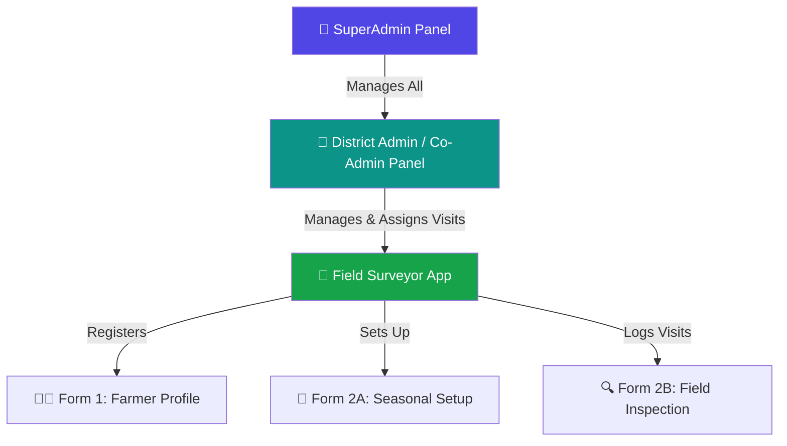
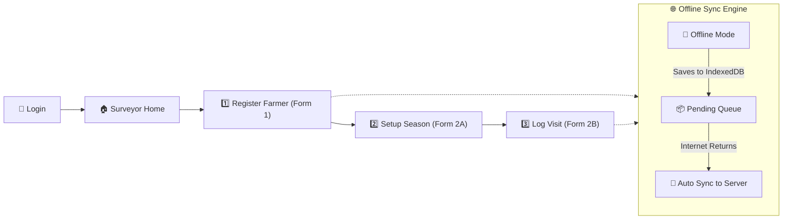
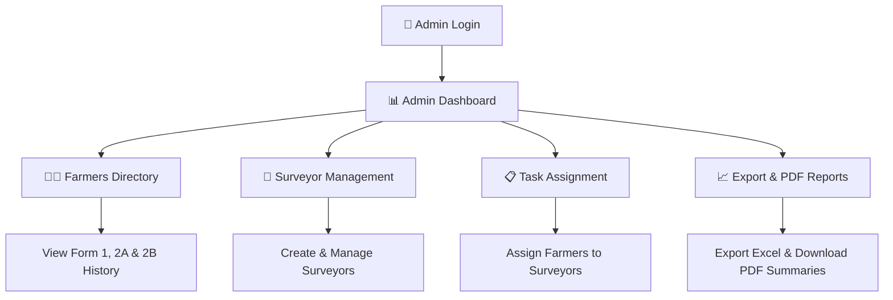
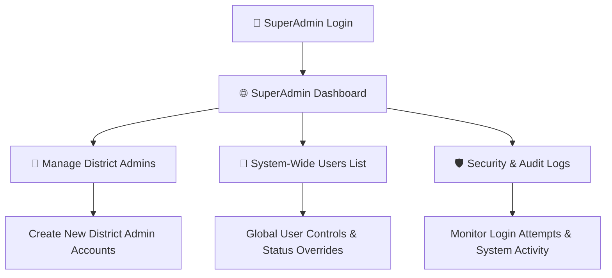

# 🌾 KisanPortal - Complete User Flow & Application Guide

---

## 📌 1. Overview & System Hierarchy

**KisanPortal** is structured into **three distinct role levels**, ensuring that each user only sees the data and controls relevant to their responsibility.

---

## 📱 2. Field Surveyor Workflow (Mobile & Web App)

The Surveyor application is designed to be **simple, fast, and 100% functional offline**. Field surveyors can collect data deep in rural areas without internet access.

### 🔹 Step-by-Step Surveyor Actions:

#### 1️⃣ Login & Session Initialization
- Surveyor logs in using their assigned `username` and `password`.
- The session is stored in the browser's `sessionStorage`, keeping it independent for that tab.
- **GPS Pre-fetching**: The app automatically captures the surveyor's current GPS location in the background.

#### 2️⃣ Form 1: Master Farmer Registration (`/surveyor/register`)
- **Action**: Used when meeting a new farmer for the first time.
- **Data Captured**: Farmer Name, Mobile Number, Village/Location, Total Land Area, Land Ownership (Owned / Leased / Shared).
- **Auto GPS Tagging**: Captures exact Latitude & Longitude coordinates with one click.
- **Unique Farmer ID**: Generates a unique tracking code (e.g. `FARMER-1042`).

> [!NOTE]
> **Offline Support**: If there is no cellular network in the village, Form 1 saves instantly to the local browser database (IndexedDB). Once the surveyor reaches an internet zone, a green banner appears: **"🌐 Network online — syncing pending records..."** and syncs data to the cloud automatically without losing work.

#### 3️⃣ Form 2A: Seasonal Crop Setup (`/surveyor/form2a/:farmer_id`)
- **Action**: Sets up the crop configuration for the active farming season (e.g. *Kharif 2026*).
- **Data Captured**: Crop Type (Rice, Wheat, Cotton, etc.), Seed Variety, Sowing Date, Expected Harvest Date, Seed Quantity per Acre, Soil/Water Testing Status, Cow Dung Usage.
- **Pre-filling**: If the farmer was already registered, existing land and profile details are pre-filled automatically.

#### 4️⃣ Form 2B: Periodic Field Visit Logging (`/surveyor/form2b/:farmer_id`)
- **Action**: Performed weekly or bi-weekly whenever a surveyor visits the farmer's field to inspect crop growth.
- **Data Captured**:
  - **Crop Health Status**: Good, Fair, Poor, or Critical.
  - **Pesticide & Fertilizer Usage**: Brand name, quantity applied.
  - **Irrigation Log**: Source (Tubewell, Canal, Rainfed), irrigation depth.
  - **Plowing & Weeding Status**.
  - **Visit Notes & Observations**.

#### 5️⃣ Assigned Visits (`/surveyor/assignments`)
- Surveyors can open their **Task List** to view farmers assigned to them by their Admin for mandatory field inspection visits.

---

## 🏢 3. District Admin & Co-Admin Workflow

The Admin Panel provides complete supervisory control over a district or company's survey team, farmer data, and task dispatching.

### 🔹 Step-by-Step Admin Actions:

#### 1️⃣ Admin Dashboard (`/admin/dashboard`)
- Displays real-time metrics:
  - **Total Farmers Registered** in the district.
  - **Active Surveyors** on duty.
  - **Total Field Visits Completed**.
  - **Recent Registrations Feed**.

#### 2️⃣ Farmers Directory (`/admin/farmers`)
- Search farmers by Name, Mobile Number, Farmer ID, or Village.
- Filter by Surveyor, Crop Type, or Season.
- **Detailed Profile Page (`/admin/farmer/:farmer_id`)**:
  - View full Form 1 registration profile.
  - View current Form 2A seasonal setup.
  - View complete chronological timeline of all Form 2B field inspection visits.
  - Download official **PDF Farmer Report**.

#### 3️⃣ Surveyor Team Management (`/admin/surveyors`)
- **Add New Surveyor**: Create login credentials (`username`, `password`, `name`, `mobile`) for new field staff.
- **Account Control**:
  - **Activate / Deactivate / Ban**: Instantly revoke access if a surveyor leaves.
  - **Reset Password**: Generate a new temporary password.
  - **Lock Session**: Force log-out on active devices.

#### 4️⃣ Visit Task Assignments (`/admin/assignments`)
- Admins can select a farmer and assign them to a specific field surveyor with instructions (e.g. *"Inspect pest attack report in Field 3"*).
- The assigned visit immediately appears on the surveyor's mobile app.

#### 5️⃣ Data Export & Reporting (`/admin/export`)
- Generate bulk Excel (`.xlsx`) or CSV reports of all survey records for official government or corporate reporting.

---

## 👑 4. SuperAdmin Workflow (Master System Control)

The SuperAdmin portal is designed for high-level executives or system owners to manage all District Admin accounts across multiple companies or geographic territories.

### 🔹 Step-by-Step SuperAdmin Actions:

#### 1️⃣ Global Overview (`/superadmin/dashboard`)
- View system-wide metrics aggregated across **all companies and districts**:
  - Total District Admin Accounts.
  - Total Surveyors across all teams.
  - Total Farmers in database.

#### 2️⃣ District Admin Management (`/superadmin/admins`)
- **Create District Admin**: Set up a new company or district account (Username, Password, District Name).
- **Manage Admins**: Edit account details, toggle active/inactive status, or reset credentials.
- **Data Isolation Guarantee**: Admins can only see their own team's data, while SuperAdmin can inspect all regions.

#### 3️⃣ System Security & Audit Logs (`/superadmin/audit`)
- Review login security history, rate-limiting triggers, and administrative actions for security auditing.

---

## 🔄 5. Summary Table: Who Can Do What?

| Feature / Action | 📱 Surveyor | 🏢 District Admin | 👑 SuperAdmin |
| :--- | :---: | :---: | :---: |
| **Log in & collect survey data offline** | ✅ | ❌ | ❌ |
| **Register new Farmers (Form 1)** | ✅ | ✅ | ✅ |
| **Fill Form 2A (Season) & 2B (Visits)** | ✅ | ✅ | ✅ |
| **View own registered farmers** | ✅ | ✅ | ✅ |
| **View all farmers in District** | ❌ | ✅ | ✅ |
| **Assign visit tasks to Surveyors** | ❌ | ✅ | ✅ |
| **Create & manage Surveyor accounts** | ❌ | ✅ | ✅ |
| **Create & manage District Admin accounts** | ❌ | ❌ | ✅ |
| **Export Excel / PDF Data Reports** | ❌ | ✅ | ✅ |
| **Global Audit & Security Controls** | ❌ | ❌ | ✅ |

---

> [!TIP]
> **Client Testing Suggestion**: To see how multi-role access works in practice, open **Tab 1** in your browser and log in as `surveyor1`, then open **Tab 2** and log in as `admin`. Because login credentials are now saved in `sessionStorage`, both tabs operate independently at the same time without interfering with each other!
